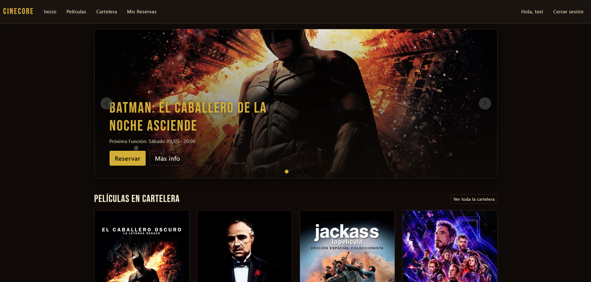
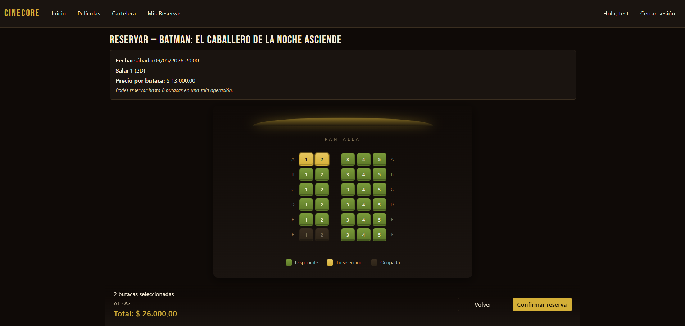
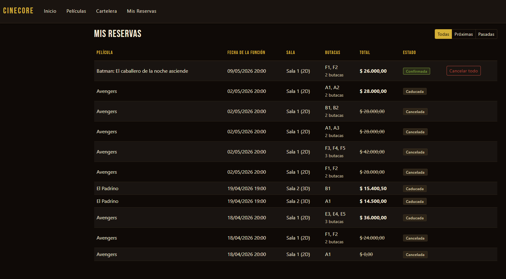
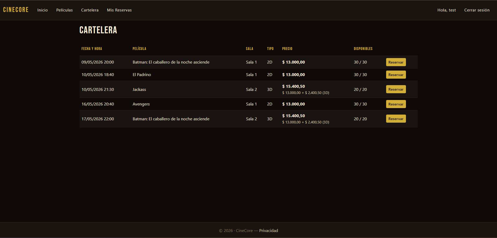
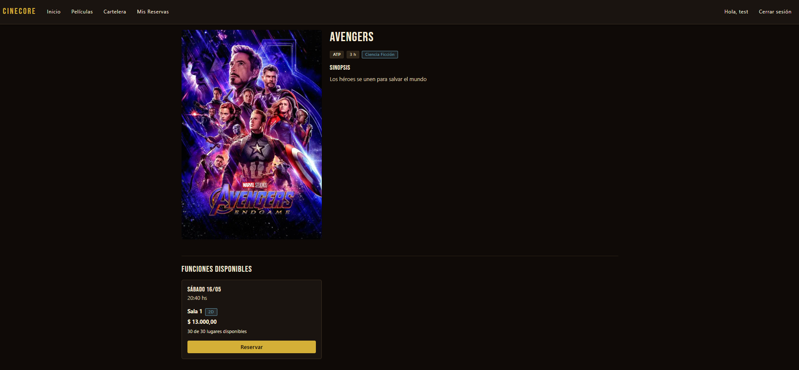
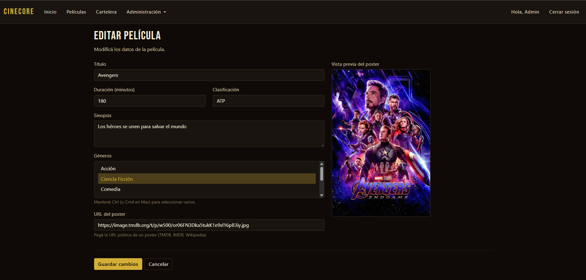
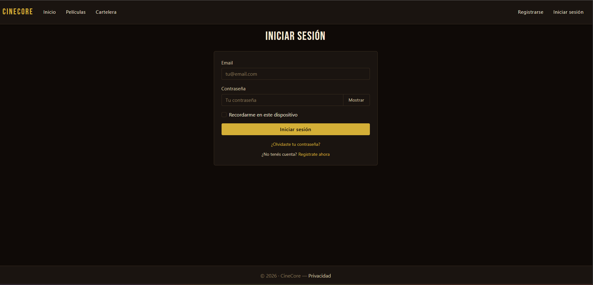

<div align="center">

# 🎬 CineCore

**Sistema completo de reservas para complejo de cines**

Aplicación web full-stack construida con ASP.NET MVC y Entity Framework Core. Gestión de cartelera, mapa de butacas interactivo, reservas múltiples y panel de administración.

[](https://dotnet.microsoft.com/)
[](https://docs.microsoft.com/aspnet/core)
[](https://docs.microsoft.com/ef/core)
[](https://www.microsoft.com/sql-server)
[](https://getbootstrap.com/)
[](https://docs.microsoft.com/aspnet/core/security/authentication/identity)

[Sobre el proyecto](#-sobre-el-proyecto) ·
[Features](#-features) ·
[Capturas](#-capturas) ·
[Stack](#-stack-técnico) ·
[Cómo correrlo](#-cómo-correrlo-localmente)

</div>

---

## 📖 Sobre el proyecto

CineCore es un sistema de reservas para un complejo de cines, pensado tanto para clientes (que quieren reservar butacas para una función) como para empleados (que administran películas, salas, funciones y géneros).

El proyecto se desarrolló con foco en **buenas prácticas de ingeniería**: separación de responsabilidades, validaciones de negocio centralizadas, sin código duplicado, sin magic numbers, mensajes y reglas de negocio en un solo lugar (single source of truth), y patrones consistentes en toda la base de código (single exit point en controladores, eager loading correcto, defensive UI).

La estética **vintage clásica** (negro plomo + dorado vintage + crema) lo diferencia visualmente de las cadenas reales como Cinemark, manteniendo una sensación cinematográfica.

---

## ✨ Features

### Para clientes
- 🎞️ **Cartelera viva** ordenada por horario, con badge "Próximamente" para películas sin funciones disponibles.
- 🎟️ **Reservas múltiples** de hasta 8 butacas en una sola operación, con validación transaccional.
- 🪑 **Mapa de butacas interactivo** estilo Cinemark adaptado al tema vintage: pantalla con resplandor dorado, butacas tipo sillón, selección en tiempo real con cálculo del total.
- 👤 **Cuenta personal** con datos de perfil, cambio de contraseña, gestión de email — todo en español.
- 📋 **Mis Reservas** en vista única cronológica con filtro por estado (Próximas / Pasadas / Todas) y diferenciación visual entre Confirmada (verde mostaza), Cancelada (terracota) y Caducada (gris).
- ❌ **Cancelar reserva** entera con un solo click.

### Para empleados
- 🎬 **CRUD de Películas** con formulario rico: multi-select de géneros, textarea para sinopsis, **preview en vivo del poster** mientras se pega la URL.
- 🏢 **CRUD de Salas, Tipos de Sala, Géneros y Funciones** con validaciones de negocio.
- 📅 **Validación de funciones**: no se puede crear una función en el pasado, no se permite solapamiento de funciones en la misma sala (con margen de pausa configurable), no se pueden editar funciones que ya pasaron.
- 🛡️ **Validación de eliminación**: no se permite eliminar películas con funciones, ni salas con funciones, ni tipos con salas asociadas.
- 🎨 **Cards de películas con hover dorado** y badge "Próximamente" para las que aún no tienen funciones programadas.

### Sistema y diseño
- 🎨 **Tema vintage clásico** con paleta dorado / crema / negro plomo y tipografía Bebas Neue para títulos.
- 🎠 **Carrusel hero** en la home con películas en cartelera (auto-rotación 5s, fade cinematográfico, indicadores y flechas tematizadas).
- 🔐 **Autenticación con Identity** y roles `Cliente` / `Empleado` con autorización granular.
- 👁️ **Toggle de visibilidad** de contraseña en todos los formularios (Login, Register, cambio de contraseña).
- ⌨️ **Focus rings dorados** vía `:focus-visible` para accesibilidad sin ruido visual al click.
- 🌐 **Localización es-AR** para formato de moneda (`$1.500,00`) y fechas (`02/05/2026`).

---

## 📸 Capturas

> 🚧 Las capturas se actualizan continuamente. Para incluirlas, agregá las imágenes en `docs/screenshots/` y reemplazá los paths abajo.

### Home con carrusel dinámico
Las películas con funciones futuras y poster cargado se muestran en rotación automática.



### Mapa de butacas estilo Cinemark
Selección en vivo con cálculo del total. Verde mostaza para disponibles, dorado para seleccionadas, gris para ocupadas.



### Mis Reservas
Vista cronológica única con tres estados visualmente diferenciados y filtro client-side.



### Cartelera completa
Listado de todas las funciones disponibles, ordenadas por fecha.



### Detalle de película
Información completa con sus funciones próximas listadas.



### Form de Película con preview en vivo
Vista previa del poster que se actualiza al pegar la URL (debounce 400ms).



### Login tematizado
Formulario en español con paleta vintage y toggle para mostrar contraseña.



---

## 🛠 Stack técnico

### Backend
- **.NET 10** con ASP.NET Core MVC.
- **Entity Framework Core** con enfoque **Code First** y migraciones.
- **ASP.NET Identity** para autenticación, autorización y roles.
- **SQL Server LocalDB** como base de datos relacional.

### Frontend
- **Razor Pages + Razor Views** para el render server-side.
- **Bootstrap 5** como base, con **CSS variables** para el sistema de design tokens.
- **Vanilla JavaScript** para interactividad puntual (toggle de password, preview de poster, filtro de reservas) — sin frameworks JS.
- **Bebas Neue** (Google Fonts) para títulos cinematográficos.

### Herramientas y patrones
- **Pattern**: MVC clásico con repositorios implícitos vía `DbContext`.
- **Validación**: DataAnnotations + `IValidatableObject` para reglas complejas (solapamiento de funciones, fechas pasadas).
- **Localización**: Cultura `es-AR` para display, `InvariantCulture` para inputs decimales del admin (con ModelBinder custom).
- **Mensajería**: `TempData` con keys centralizados para banners flash de éxito/error.

---

## 🏗 Arquitectura y decisiones clave

### Patrones aplicados

- **Single exit point** en todos los controladores: una sola variable `IActionResult result` declarada al inicio del método y un único `return result` al final. Mejora la legibilidad y el debugging.
- **Sin early returns**: las validaciones se hacen con `if/else if/else` en cascada, no con `return` prematuros.
- **Sin magic numbers ni magic strings**: todas las constantes (máximo butacas por reserva, margen mínimo de creación, pausa entre funciones, filas por sala) están centralizadas en `Helpers/ReglasNegocio.cs`. Los mensajes al usuario, en `Helpers/Mensajes.cs`. Las claves de TempData, en `Helpers/TempKeys.cs`.
- **Eager loading explícito** con `Include` y `ThenInclude` para evitar el problema N+1.
- **Defensive UI**: empty states en todas las vistas (si no hay datos, se muestra un mensaje informativo en lugar de tablas vacías).

### Reglas de negocio destacadas

- Una función no puede crearse si su horario es anterior al margen mínimo (30 minutos antes del momento actual por default).
- Dos funciones no pueden solapar en la misma sala — se valida considerando la duración de cada una más una pausa configurable (15 minutos por default).
- Una sala no puede modificar su capacidad después de creada (la grilla de butacas es inmutable).
- Las butacas se generan automáticamente en filas A-F al crear una sala. La capacidad debe ser múltiplo de 6.
- Una reserva captura el **precio pagado en el momento de reservar** (snapshot), de modo que cambios posteriores en el precio de la función o el tipo de sala no afectan reservas existentes.
- Cancelar una reserva grupal cancela todas las butacas del mismo grupo (mismo cliente + función + timestamp de reserva).

### Estructura de carpetas

```
CineCore/
├── Areas/Identity/Pages/Account/    # Login, Register, Logout, Manage (todo en español)
├── Controllers/                     # 8 controladores MVC
├── Data/                            # ApplicationDbContext + Migrations
├── Helpers/                         # ReglasNegocio, Mensajes, TempKeys, Money, Duracion, FuncionExtensions
├── Models/                          # Entidades + ViewModels
│   └── ViewModels/                  # MisReservasViewModel, HomeViewModel
├── ModelBinders/                    # DecimalInvariantModelBinder
├── Views/                           # Razor views por entidad
└── wwwroot/
    ├── css/                         # cinecore-theme.css, butacas.css, site.css
    └── js/                          # cinecore-password.js, cinecore-poster-preview.js
```

---

## 💾 Modelo de datos

### Entidades principales

| Entidad | Relaciones |
|---|---|
| **Pelicula** | `n:m` con Genero, `1:n` con Funcion |
| **Genero** | `n:m` con Pelicula |
| **Sala** | `n:1` con TipoSala, `1:n` con Butaca, `1:n` con Funcion |
| **TipoSala** | `1:n` con Sala (ej: 2D, 3D, IMAX con su precio extra) |
| **Butaca** | `n:1` con Sala (filas A-F, generadas automáticamente) |
| **Funcion** | `n:1` con Pelicula, `n:1` con Sala, `1:n` con Reserva |
| **Reserva** | `n:1` con Funcion, `n:1` con Butaca, `n:1` con ApplicationUser |
| **ApplicationUser** | extiende `IdentityUser` con Nombre, Apellido, Telefono, FechaNacimiento |

### Enums

- **EstadoReserva**: `Pendiente`, `Confirmada`, `Cancelada`.
- **Roles**: `Cliente`, `Empleado` (definidos como constantes en `Models/Roles.cs`).

---

## 🚀 Cómo correrlo localmente

### Pre-requisitos

- [.NET 10 SDK](https://dotnet.microsoft.com/download)
- [SQL Server LocalDB](https://docs.microsoft.com/sql/database-engine/configure-windows/sql-server-express-localdb) (incluido con Visual Studio)
- [Visual Studio 2022](https://visualstudio.microsoft.com/) o equivalente con soporte .NET

### Pasos

1. **Clonar el repositorio**

   ```bash
   git clone https://github.com/AgustinPagliuca/CineCore.git
   cd CineCore
   ```

2. **Restaurar dependencias**

   ```bash
   dotnet restore
   ```

3. **Aplicar migraciones**

   La cadena de conexión por defecto apunta a SQL Server LocalDB. Para crear la base:

   ```bash
   dotnet ef database update --project CineCore
   ```

4. **Correr la aplicación**

   ```bash
   dotnet run --project CineCore
   ```

   O desde Visual Studio: presionar **F5**.

5. **Acceder**

   Abrir [https://localhost:7089](https://localhost:7089) en el navegador.

### Datos iniciales

La base se crea vacía. Para tener algo con qué probar:

1. Registrate como cliente desde `/Identity/Account/Register`.
2. Para acceder al panel de administración, asignate manualmente el rol `Empleado` desde la base de datos:

   ```sql
   -- Suponiendo que tu UserId es 'abc-123-...' y el rol 'Empleado' ya existe en AspNetRoles
   INSERT INTO AspNetUserRoles (UserId, RoleId)
   SELECT 'tu-user-id', Id FROM AspNetRoles WHERE Name = 'Empleado';
   ```

3. Cargá géneros, tipos de sala, salas, películas y funciones desde el menú **Administración**.
4. Para los posters, podés usar URLs públicas de TMDB. Ejemplo:
   ```
   https://image.tmdb.org/t/p/w500/or06FN3Dka5tukK1e9sl16pB3iy.jpg
   ```

---

## 🗺 Roadmap

Lo que está en mente para próximas iteraciones:

- [ ] **Deploy en Render.com** con migración a PostgreSQL.
- [ ] **Subida de archivos** para posters (en lugar de URL externa).
- [ ] **Seed inicial** con datos de prueba al primer arranque.
- [ ] **Sistema de notificaciones** por email al confirmar/cancelar reservas (requiere SMTP).
- [ ] **Recuperación de contraseña** funcional (depende de SMTP).
- [ ] **Página de empleado** para ver reservas de cada función.
- [ ] **Estadísticas** (películas más vistas, ocupación promedio por sala, etc.).
- [ ] **Tests unitarios** sobre las reglas de negocio críticas.

---

## 👤 Sobre el autor

**Agustín Pagliuca**

🌐 [agustinpagliuca.github.io/Portfolio](https://agustinpagliuca.github.io/Portfolio/)
💼 [LinkedIn](https://www.linkedin.com/in/agustin-pagliuca-6836b7237/)
📧 [agustinpagliuca1@gmail.com](mailto:agustinpagliuca1@gmail.com)

---

<div align="center">

⭐ Si te resultó interesante el proyecto, dejá una estrella en el repo.

</div>